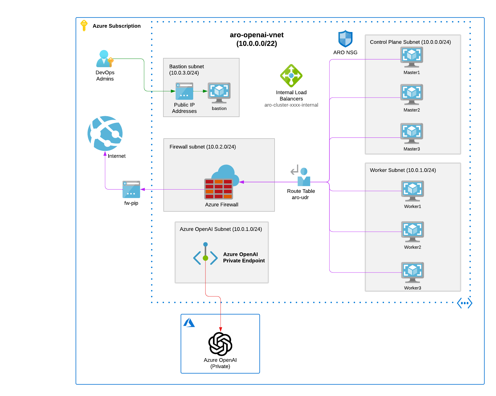
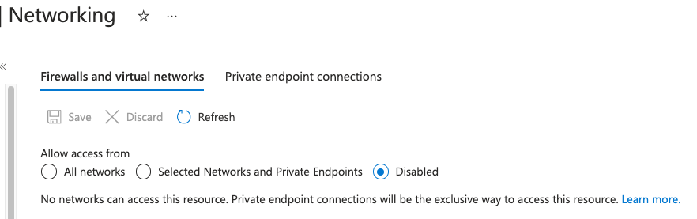

# ARO Azure OpenAI Secure Baseline

A repository for deploying Azure Red Hat OpenShift (ARO) and Azure OpenAI within a secure baseline, ensuring full privacy and security compliance.

## Secure Baseline ARO and Azure OpenAI HDL Diagram



* **IMPORTANT**: The Azure OpenAI networking is with a private endpoint, so the OpenAI service is not exposed to the internet. **The OpenAI service is only accessible from the ARO cluster**.

## Azure Red Hat OpenShift Private cluster

* Deploy a private cluster with Azure Red Hat OpenShift (ARO) using the [Terraform-ARO repository](https://github.com/rh-mobb/terraform-aro):

  ```bash
  git clone https://github.com/rh-mobb/terraform-aro.git
  cd terraform-aro
  ```

* Create a `terraform.tfvars` file with the following content:

  ```bash
  make tfvars
  ```

* Modify the terraform.tfvars var file, you can use the variables.tf to see the full list of variables that can be set.

  ```bash
  make create-private
  ```

 >NOTE: You can define the subscription_id needed for the Auth using export TF_VAR_subscription_id="xxx" as well.

* Deploy your private cluster

  ```bash
  make create-private
  ```

1. Get the ARO cluster's api server URL.

   ```bash
   ARO_URL=$(az aro show -n $AZR_CLUSTER -g $AZR_RESOURCE_GROUP -o json | jq -r '.apiserverProfile.url')
   echo $ARO_URL
   ```

1. Get the ARO cluster's Console URL

   ```bash
   CONSOLE_URL=$(az aro show -n $AZR_CLUSTER -g $AZR_RESOURCE_GROUP -o json | jq -r '.consoleProfile.url')
   echo $CONSOLE_URL
   ```

1. Get the ARO cluster's credentials.

   ```bash
   ARO_USERNAME=$(az aro list-credentials -n $AZR_CLUSTER -g $AZR_RESOURCE_GROUP -o json | jq -r '.kubeadminUsername')
   ARO_PASSWORD=$(az aro list-credentials -n $AZR_CLUSTER -g $AZR_RESOURCE_GROUP -o json | jq -r '.kubeadminPassword')
   echo $ARO_PASSWORD
   echo $ARO_USERNAME
   ```

## Deploy Azure OpenAI fully private

The code sets up an OpenAI module in Azure, configuring the resource group, location, a private endpoint, and deploying two specific OpenAI models (gpt-35-turbo and text-embedding-ada-002) with defined capacities.

```bash
make create-openai-private
```

* **IMPORTANT**: The networking is with a private endpoint, so the OpenAI service is not exposed to the internet. **The OpenAI service is only accessible from the ARO cluster**.


