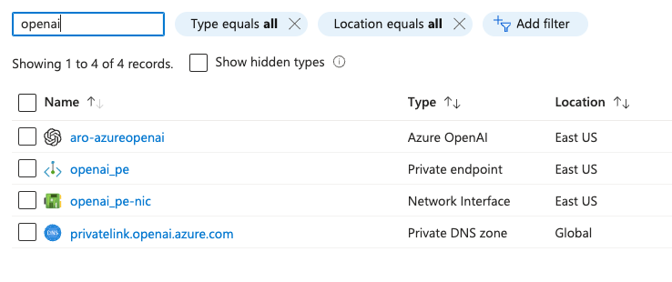

## **[Private Endpoints for OpenAI](https://learn.microsoft.com/en-us/azure/ai-services/cognitive-services-virtual-networks?context=%2Fazure%2Fai-services%2Fopenai%2Fcontext%2Fcontext&tabs=portal#use-private-endpoints)** resources:

Private endpoints for Azure AI services resources let you:
  * Secure your Azure AI services resource by **configuring the firewall to block all connections on the public endpoint for the Azure AI service**.
  * Increase security for the virtual network, by enabling you to **block exfiltration of data from the virtual network**.
  * **Securely connect to Azure AI** services resources from **on-premises networks** that connect to the virtual network by using **Azure VPN Gateway** or **ExpressRoutes** with private-peering.

* If we try to reach the OpenAI service from the Jumphost (is not even reachable from Internet) to the OpenAI url model API, we will get an error:

```md
[aro@aro-rcarrata-jumphost ~]$ export AZURE_OPENAI_ENDPOINT="https://aro-azureopenai.openai.azure.com/"

[aro@aro-rcarrata-jumphost ~]$ curl $AZURE_OPENAI_ENDPOINT/openai/deployments/gpt-35-turbo/completions?api-version=2023-05-15   -H "Content-Type: application/json"   -H "api-key: $AZURE_OPENAI_KEY"   -d "{\"prompt\": \"Once upon a time\"}"
{"error":{"code":"403","message": "Public access is disabled. Please configure private endpoint."}}
```

* The response is a 403 error, meaning that the public access is disabled and we need to configure a private endpoint.

### Describing **[Private Endpoints for OpenAI](https://learn.microsoft.com/en-us/azure/ai-services/cognitive-services-virtual-networks?context=%2Fazure%2Fai-services%2Fopenai%2Fcontext%2Fcontext&tabs=portal#use-private-endpoints)** resources:

* By default, Azure creates a private DNS zone attached to the virtual network with the necessary updates for the private endpoints.



* The private endpoint for the Azure AI service is created in the virtual network and is assigned an IP address from the virtual network address space.

* The private endpoint uses an IP address from the virtual network address space for your Azure AI services resource.


* Network traffic between the clients on the virtual network and the resource traverses the virtual network and a private link on the Microsoft Azure backbone network, **which eliminates exposure from the public internet**.

```md
export AZURE_OPENAI_ENDPOINT="aro-azureopenai.privatelink.openai.azure.com"

[aro@aro-rcarrata-jumphost ~]$ nslookup $AZURE_OPENAI_ENDPOINT
Server:         168.63.129.16
Address:        168.63.129.16#53

Non-authoritative answer:
Name:   aro-azureopenai.privatelink.openai.azure.com
Address: 10.0.14.4
```

* If we export the private endpoint URL and try to reach the OpenAI service from the Jumphost, we will get a valid response:

```md
export AZURE_OPENAI_ENDPOINT="https://aro-azureopenai.privatelink.openai.azure.com/"
```

* The response is a valid completion from the OpenAI service:

```md
curl $AZURE_OPENAI_ENDPOINT/openai/deployments/gpt-35-turbo/completions?api-version=2023-05-15   -H "Content-Type: application/json"   -H "api-key: $AZURE_OPENAI_KEY"   -d "{\"prompt\": \"Once upon a time\"}" -k | jq -r .

{
   "id":"cmpl-8nrUqRiK7to0EVEe2U0mn003OLX1e",
   "object":"text_completion",
   "created":1706894404,
   "model":"gpt-35-turbo",
   "choices":[
      {
         "text":", there lived a pretty maiden. Her beauty drew many suitors, though she",
         "index":0,
         "finish_reason":"length",
         "logprobs":null
      }
   ],
   "usage":{
      "prompt_tokens":4,
      "completion_tokens":16,
      "total_tokens":20
   }
```
